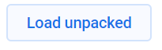

# LlenaloJS

 

Esta extensión de Chrome ayuda a la gente a llenar de manera autómatica extensos formularios a través de posteos automatizados. Esta extensión es 100% open-source, licencia MIT y abierta a la comunidad. La mantenemos en el grupo 'PodemosAprender' (https://www.facebook.com/podemosaprendermas/). Esta extensión se puede usar para automatización de procesos, como el llenalo de grandes plantilllas de datos de una manera más automatizada. 

## Instalación para entorno de desarrolo

Si quéres colaborar en este repositorio estos son los pasos a seguir:

1)  Forkear el repositorio

2)  Clonar el repositorio
` git clone https://github.com/tuUsuario/llenalojs.git `

3)  Configuramos la extensión en Chrome

*  Entramos a chrome://extensions
*  Le damos a developer mode.

*  Cargamos el carpeta de nuestra aplicación en 'load unpackage'

## Estilo de CSS

-   [MDL](https://getmdl.io/ "Material Design Lite")

## Package roadmap

-   [ ] Llenar un formulario de manera automatica.
-   [ ] Agregar opciones personalizadas.

## Licencia

MIT

## Contribuir

*  Fijate de leer la documentación para crear extensiones de Chrome:
[Link](https://developer.chrome.com/extensions/getstarted "Link")
*  Asegurate de leer las guias para desarrollar extensiones en Chrome:
[Link](https://developer.chrome.com/extensions/single_purpose "Link")
*  El archivo **js/background.js** es donde se ejecuta el código que queremos.
*  El archivo **popup.html** es donde esta la UI de nuestra extensión.
*  Usamos estilo de código AIRBNB. [AIRBNB JS CODE STYLE](https://dev.mysql.com/doc/ "AIRBNB JS CODE STYLE")
*  Fijate de testear todo código nuevo con chai. El archivo para los tests es **test/test.js**. Y ejecutamos la prueba con ` npm run test ` .
*  Antes de comitear dale ` npm run lint -- --fix ` para lintear el código.
*  Una vez que pusheaste y/o se aceptó tu pull request fijate de chequear que puedas correr la extensión y corra el build en travis:
[Link](https://travis-ci.org/patelotech/llenalojs "Link")
*  Para empaquetar la extensión dale a ` npm run zip ` .Eso te va a servir para luego publicar la extensión en Chrome:
[Link](https://chrome.google.com/webstore/developer/update "Link")

